# Travel Agency Application
>Java client-server application for 3rd year university lessons.

## Table of contents
* [General](#general)
* [Screenshots](#screenshots)
* [Techstack](#techstack)
* [Features](#features)
* [Setup](setup)
* [VM options](#vm_options)
* [Status](#Status)
* [Contact](#Contact)
## General
This is a server - client application simulating Travel agency.\
It has server, which connects with MySql database and client sides.\
Client can be either customer or employee of agency (login/password "admin").
## Screenshots

  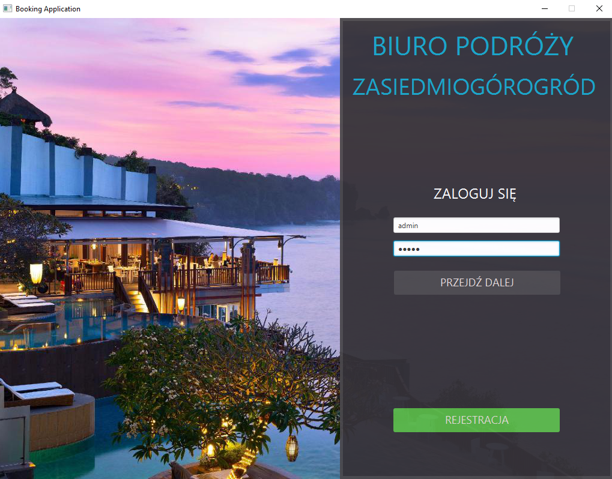
  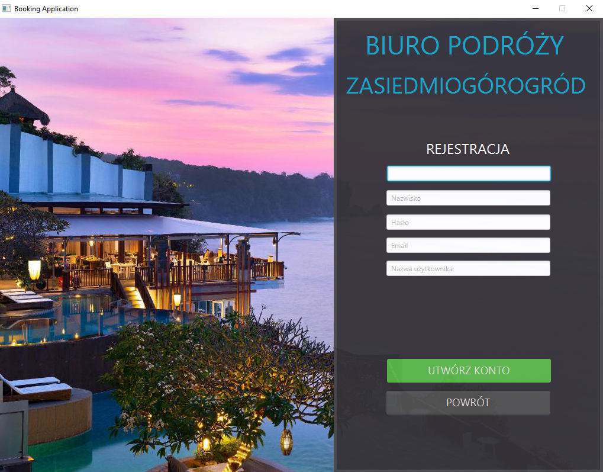
  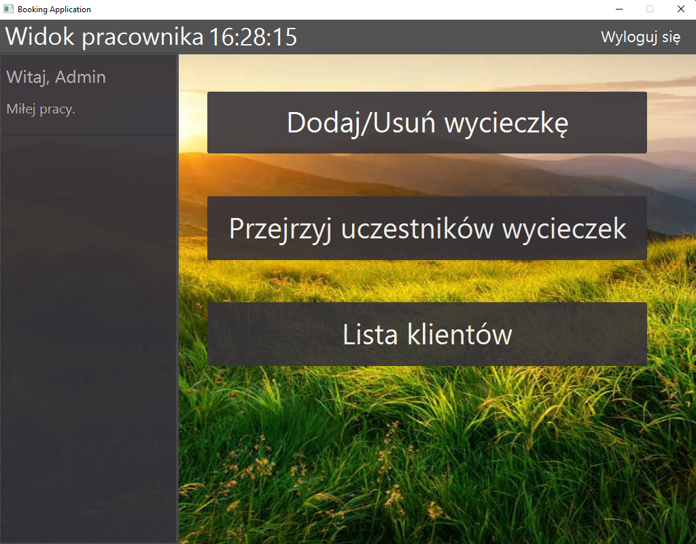
  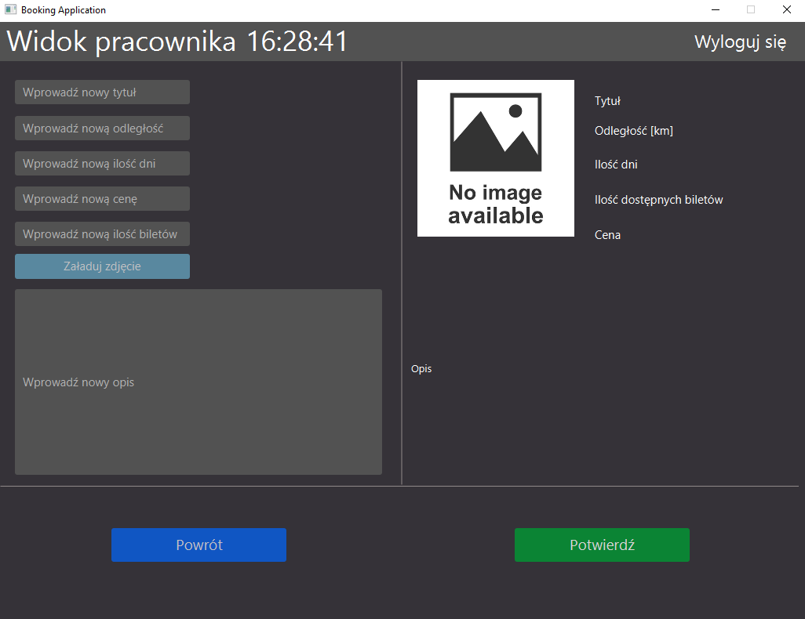
  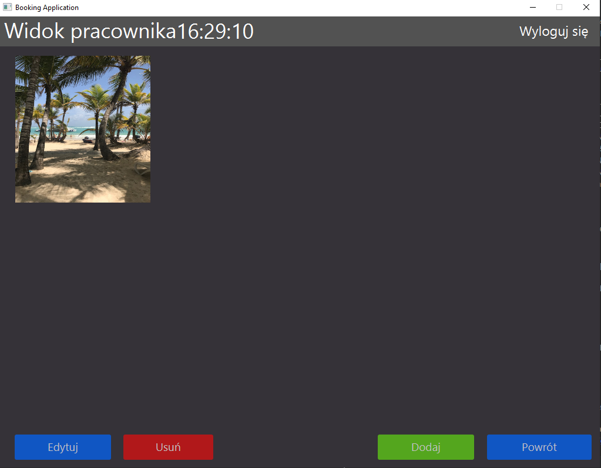
  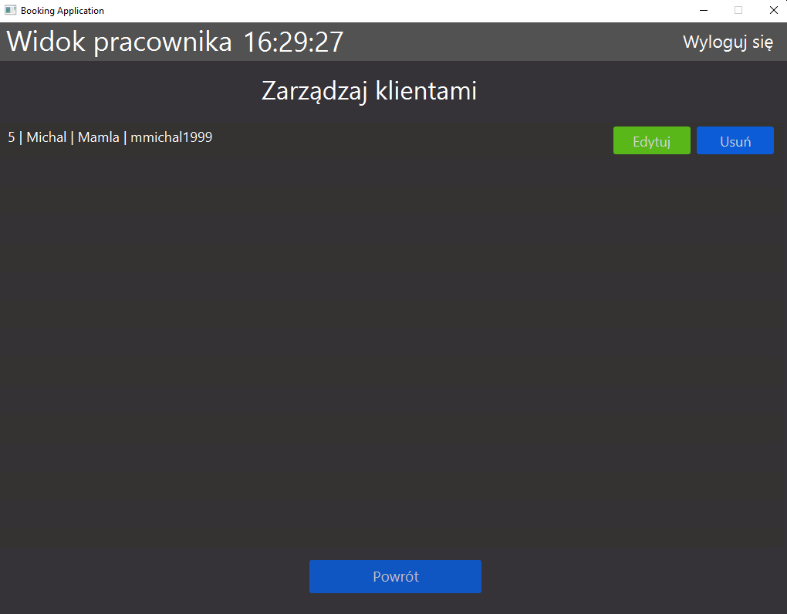
  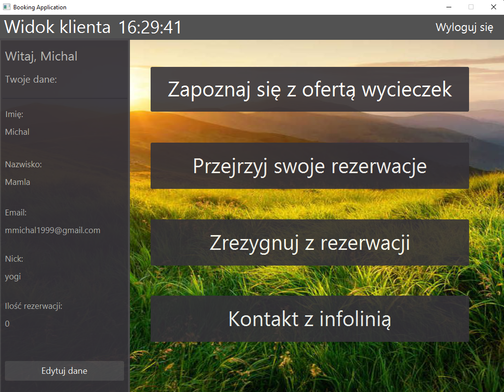
  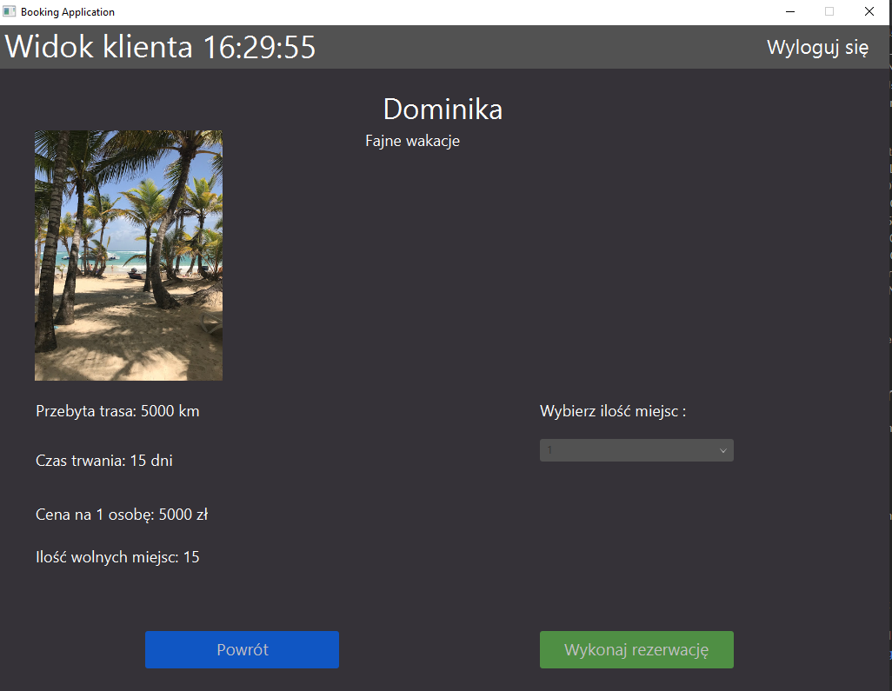
  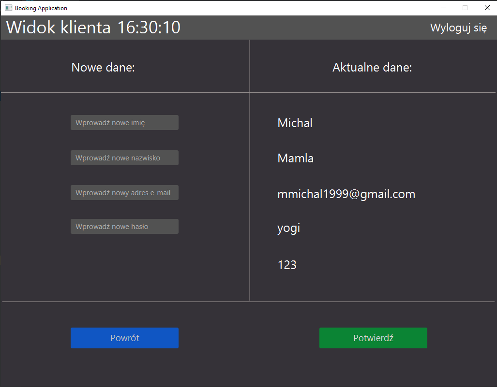
  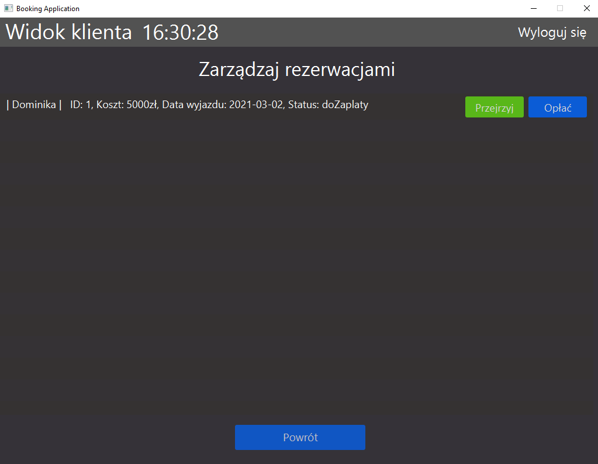
  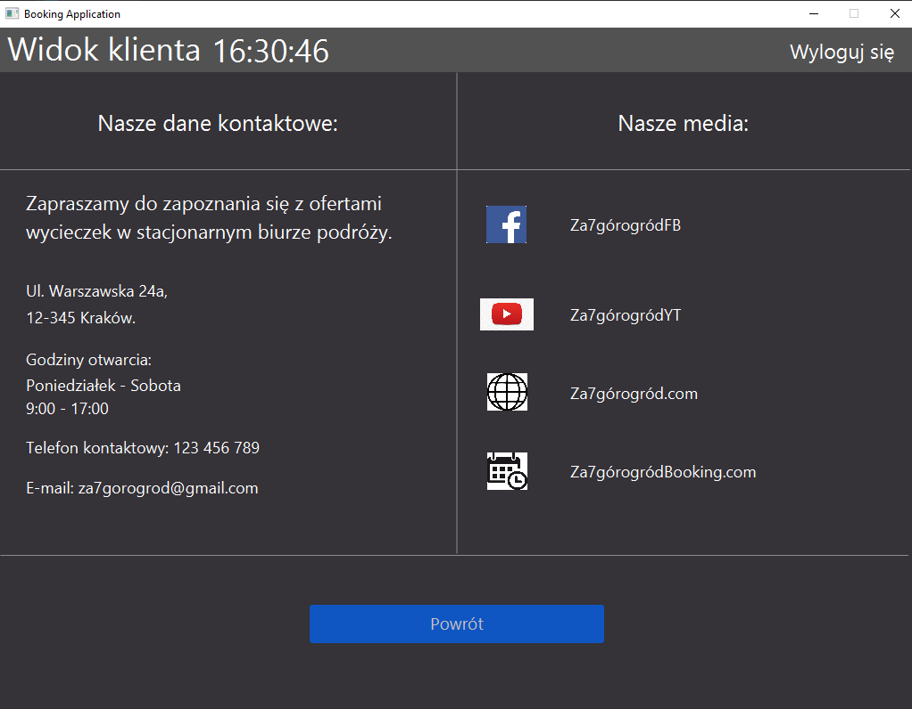
  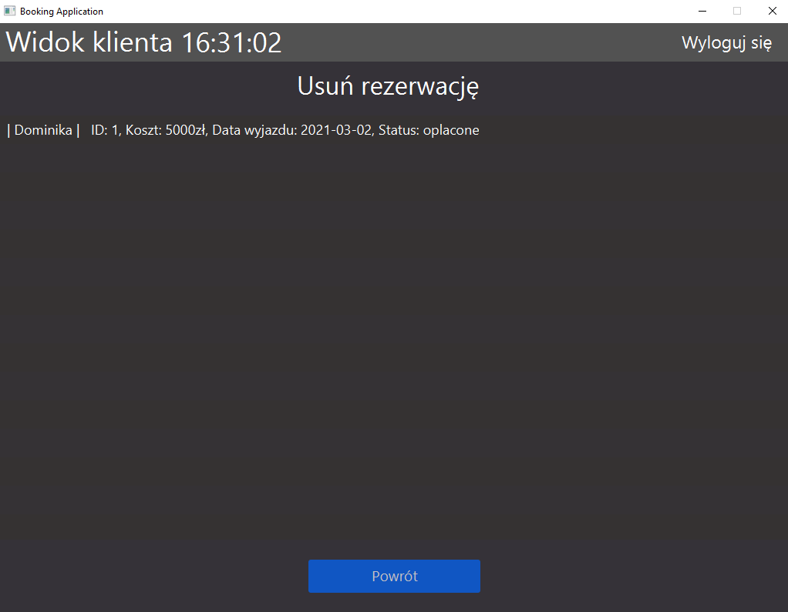

## Techstack:
- JDK 11
- Maven
- JavaFX
- MySQL 
- Lombok
- TestNG
- JUnit
- fasterXML

## Features
* Add, modify, delete tours (employee side)
* Modify and delete customers (employee side)
* Real-time clock
* MultiThreading
* Make reservation (client side)
* Modify and delete reservation (client side)
* Change client data (client side)
* See contact info (client side)
* Delete not paid reservation at the end of the day automatically

## Setup
Create database 'filmdb' via MySql CMD on your localhost and make sure it has all priviliges.

create database filmdb;

create table filmdb.users(\
idUser int PRIMARY KEY NOT NULL,\
userLogin varchar(45) NOT NULL,\
userPassword varchar(45) NOT NULL,\
userName varchar(45) NOT NULL,\
userSurname varchar(45) NOT NULL,\
userEmail varchar(45) NOT NULL\
);

create table filmdb.reservations(\
reservationsId int NOT NULL PRIMARY KEY,\
idUser int NOT NULL,\
tourId int NOT NULL,\
totalPrice varchar(45) NOT NULL,\
date date NOT NULL,\
status varchar(45) NOT NULL,\
FOREIGN KEY(idUser) REFERENCES users(idUser),\
FOREIGN KEY(tourId) REFERENCES tours(tourID)\
);

create table filmdb.tours(\
tourId int NOT NULL PRIMARY KEY,\
title varchar(45) NOT NULL,\
text varchar(500) NOT NULL,\
distance varchar(45) NOT NULL,\
days varchar(45) NOT NULL,\
price varchar(45) NOT NULL,\
availableTickets varchar(45) NOT NULL,\
image varchar(45) NOT NULL\
);

Run server first, then client application.

## Vm_options

--module-path "path-to-your-javafx" --add-modules=javafx.controls,javafx.fxml

## Status
This project is finished and will not be updated.

## Contact
Feel free to contact if you have any question
* email: mmichal1999@gmail.com
* github: https://github.com/bearyogi/
